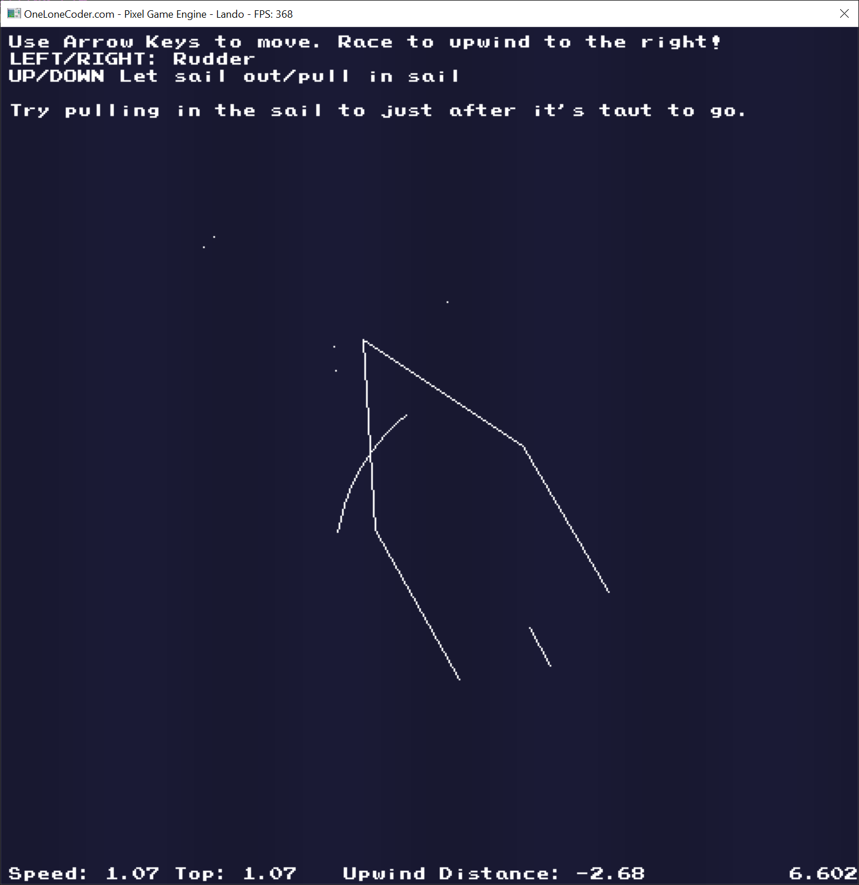

# SAIL (Simulator for Aviation on Interface of Liquid)
  It's a sailing game! The sail boat is simulated using lift and drag equations, with made up coefficient, I'm surprised how well it turns out to simulate sailing. Made for the olc::BeatTheBordem Game Jam 2020, with the theme of outdoors.
  
## Goal
  Go 50 m upwind, with the wind coming from the right of the screen.
## Controls
### Arrow keys
- UP: Let the sail out
- DOWN: Pull the sail in
- LEFT: Move the rudder to the left, to go left.
- RIGHT: Move the rudder to the right, to go right.
## Camera
- NUMBER 1 & 2 will zoom in and out.
## Game state controls:
- SPACE: Advance 1 frame at a time (pauses too).
- TAB: Pause/unpause.
- ENTER: Show Debugging information.
- R: Reset the game.
- When paused, WASD will move the camera around

###  Physics Caveats:
  The lift and drag of the sail & keel are accounted for, however not in the moments. The rudder does not produced any drag, but it does produce a moment, otherwise it wouldn't work. The fidelity and realism would be improved if the sail did produce it's own moment, and it would make starting off easier. Ha! Normal and Axial force coefficients of all foils are just made up completely by me.
  Uses First order time stepping. Things get really bad in on a slow computer at the minimum tick rate of 200Hz when you're really speeding.
  The sail is procedurally animating according to the lift and drag on the sail, but the shape of it is art, not science.

# Dependencies
This uses nanosvg,h and olcPixelGameEngine.h
# License (OLC-3)
 (I don't know how to do this properly. What's Javid's and the OLC community is theirs, and I would like to distrubte this software under the OLC-3 license, however it apples.)

Redistribution and use in source and binary forms, with or without modification, are permitted provided that the following conditions are met:

1. Redistributions or derivations of source code must retain the above copyright notice, this list of conditions and the following disclaimer.

2. Redistributions or derivative works in binary form must reproduce the above copyright notice. This list of conditions and the following disclaimer must be reproduced in the documentation and/or other materials provided with the distribution.

3. Neither the name of the copyright holder nor the names of its contributors may be used to endorse or promote products derived from this software without specific prior written permission.

THIS SOFTWARE IS PROVIDED BY THE COPYRIGHT HOLDERS AND CONTRIBUTORS "AS IS" AND ANY EXPRESS OR IMPLIED WARRANTIES, INCLUDING, BUT NOT LIMITED TO, THE IMPLIED WARRANTIES OF MERCHANTABILITY AND FITNESS FOR A PARTICULAR PURPOSE ARE DISCLAIMED. IN NO EVENT SHALL THE COPYRIGHT HOLDER OR CONTRIBUTORS BE LIABLE FOR ANY DIRECT, INDIRECT, INCIDENTAL, SPECIAL, EXEMPLARY, OR CONSEQUENTIAL DAMAGES (INCLUDING, BUT NOT LIMITED TO, PROCUREMENT OF SUBSTITUTE GOODS OR SERVICES; LOSS OF USE, DATA, OR PROFITS; OR BUSINESS INTERRUPTION) HOWEVER CAUSED AND ON ANY THEORY OF LIABILITY, WHETHER IN CONTRACT, STRICT LIABILITY, OR TORT (INCLUDING NEGLIGENCE OR OTHERWISE) ARISING IN ANY WAY OUT OF THE USE OF THIS SOFTWARE, EVEN IF ADVISED OF THE POSSIBILITY OF SUCH DAMAGE.

olcPixelGameEngine.h is subject to the OLC-3 LICENSE, copyright Javidx9 (OneLoneCoder.com).
nanosvg.h is subject to it's own license.
